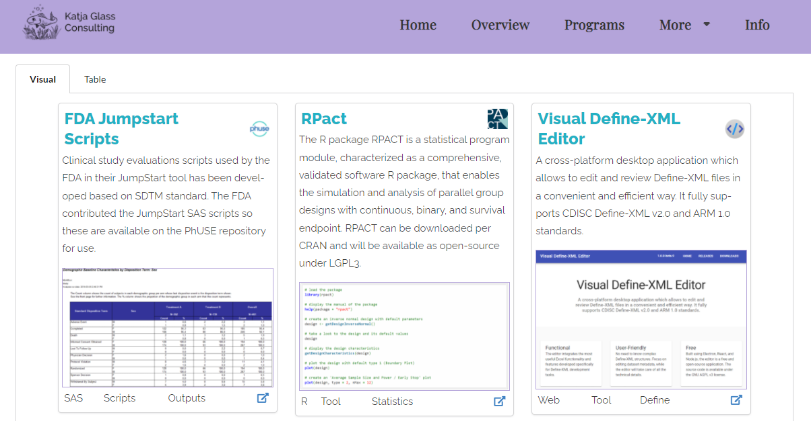

# clinicalOpenSourcePortal - collaboration space for the [Open Source Portal for Clinical Study Evaluations](https://www.glacon.eu/portal/)

The [Open Source Portal for Clinical Study Evaluations](https://www.glacon.eu/portal/) provides information about open source which is available in the area of clinical study evaluations.

To support contribution to the portal, everyone can submit additional tools, programs or an article which might become (modified or unmodified) published on that website.

As this project is using MIT, please be aware that the information provided here might also be used differently.

## License

This project is using the [MIT](http://www.opensource.org/licenses/MIT "The MIT License | Open Source Initiative") license (see [`LICENSE`](LICENSE)) for code and scripts.

## Contribution

When you contribute to this repository you are doing so under the above license.

To include content, please follow the instructions for the specific areas and see the examples in the repository. When you are done with your update, please perform a pull-request. 

Different types can be contributed to the portal. Please look into the detailed instructions for each:

- [Instructions to add Open-Source Tool (/tools)](instructions_tools.md)
- under development: [Instructions to add Open-Source Programs (/programs)](instructions_programs.md)
- under development: [Instructions to add an article (/article)](instructions_article.md)
