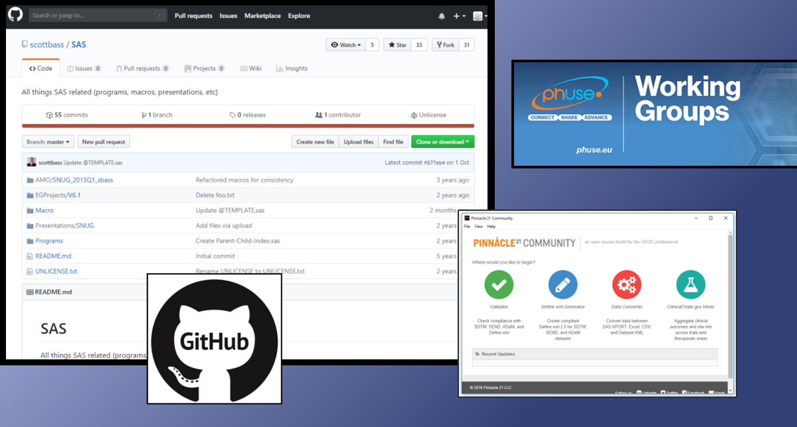

# Open Source in Clinical Study Evaluations

There are many advantages of having open source solutions available, particularly for
industries where the main focus is not programming, but science. However, in clinical study
evaluations there are just a very few open source programs available. Why? Where are the
advantages? And what are the risks in our industry? This article will give you a short
introduction and hopefully make you think about how we can go forward with open source.

Too long to read? [Here](https://www.youtube.com/watch?v=af321V1XkTI) is a 7 minute video with the content.

## Pinnacle21 Community as Open Source Example

The "Pinnacle21 Community" tool – starting as OpenCDISC Validator – is a good example for an
    open source project. A great tool kit has been developed and used throughout the industry.
    It quickly became very famous and is now an important standard tool which is strongly
    recommended to use – and in case of PMDA even required.

As the popularity grew, more user requirements raised and funding has become more and more a
    topic. An enterprise version had been developed to be able to scope with all challenges.
    Nowadays Pinnacle21 is a very well running company. A blog about the history of OpenCDISC is
    available on their [website](https://www.pinnacle21.com/blog/the-history-of-opencdisc).

Despite this story of success there are many critics around this tool kit. But why? The focus
    on commercializing the enterprise version seems to spoil the open source edition driving it
    almost into a neglected project. An enterprise version can of course have additional
    functionality, but missing out some core functionalities or even thinking about removing
    options from the open version is difficult to handle. Fortunately, at least some important
    functionality enhancements will be made available in the community version 3.0 which should
    be released soon.

Pinnacle21 has a monopoly position here. A complete industry relies on this tool for
    validation checks. Commercially it does not make sense to create a product in this area, as
    the core functionality is available for free in the community version and the investment for
    something similar would be much too high. Due to the license, a reuse is not possible. And
    missing competitions always results in issues and critics.

## Lessons learned

So, what can our industry learn from this? First of all, open source projects have typically
    to cope with issues regarding funding. Everyone likes to have tools available for free, but
    somehow these must also be funded. And depending on the license you can either stimulate or
    prevent competition. From the customers a competition is highly appreciated, but for service
    providers these competitions mean risks and would normally better avoided.

## Ways to go with Collaborations

First of all, the companies have to decide how open they would like to be. There exist many
    open collaborations. Most of them driven by the [PhUSE](https://phuse.global/Working_Groups) which is a community consisting of those
    colleagues working in clinical study evaluations and related areas. The PhUSE provides
    collaboration platforms for many working groups. One of those is specifically concentrating
    on "Standard Analyses &amp; Code Sharing".
    Unfortunately, the results did not meet the high expectations in this area, yet.

On the other hand, there are of course close collaborations where something is developed with
    just a few members. And finally, there are closed collaborations available with multiple
    companies where things are shared just within the membership.

Ideally collaborations should be open to support the complete industry as well as academia.
    Especially programs, tools and processes should be shared to be able to find best
    collaborative solutions which enables transparency and standardization also in the
    programming area of clinical study evaluations.

## Why just few open sources?

What are the reasons why there are just a few open source programs and projects available?
    The area of clinical study evaluations is a very specific area with high regulations and
    long-term players on the marked. Typically, large companies have their own solutions
    available. They do not have an advantage of giving this away. Tools do not only consist of
    the programs itself, but also require documentation, training and validation. Who should
    provide all the required information? Putting a tool online is likely not sufficient.

Why are there no engaged people putting things together for free like what we see in other
    technological ecosystems? My guess is this is highly related to the purpose of clinical
    study evaluations. Only companies – typically large Pharma companies – would benefit from
    such open source projects. And as mentioned before, putting source and tools together for
    clinical study evaluations is not sufficient. Looking into the life cycle of tools in this
    area, in my experience less than 10% of the effort is going into the development part. The
    remaining 90% serves documentation, validation and provision of training – not to mention
    the important maintenance when updates are required or even bugs appear. There are hardly
    many people volunteering to perform these 90% for free.

## Funding to get Open Source

A possible solution could be funding projects which are made available as open source. The
    question is whether companies see value in funding such projects and whether there are
    companies or persons who will provide their tools and programs as open source.

The most important factor for companies funding open source is the benefit. What would they
    gain? Or do they just have to pay so their competitors get the same solution for free? The
    more funding companies are supporting a project, the less expensive it will be for each one
    of them. But more stakeholders mean higher complexity as more communication and negotiation
    is required.

The main advantage for the funding company would be that they are involved in defining the
    project scope, content and direction. They are most likely the first testers and have direct
    influence on the development. Furthermore, they could even decide which parts will be made
    available as open source. Not necessarily everything needs to be made available. Extended
    documentation, training and validation could be kept in the project and available just for
    membership. Funders might even agree on a regular membership fee which could be made fixed
    to ensure further development, availability for updates and questions – especially urgent
    authority questions – at constant costs. In such a case competitors and academia could use
    the programs and tools, but for extended services, they can join through membership.

When the programs and tools are made available completely free also for commercial content,
    e.g. with the MIT license, then other companies could use this work and provide nice user
    interface or combine the solution in their own tools. A monopoly could be avoided. Of
    course, there is the risk that someone takes the programs and tools and create own services
    like extended documentation, validation and so forth. But is this a really a risk or just an
    opportunity? More competition means more solutions to choose from. Actually, this is
    something we strongly need in our industry. Currently many areas have just too few or no
    solutions available.

## Starting Small, then Growing

There are many areas where solutions would be required in the clinical study evaluation area.
    Starting with a huge project scope would by risky, but a small project could prove how
    things are working and whether the benefits are worth the costs. So why not starting with a
    small project which has the option to start small and grow huge? It can simply be performed
    by a consultant which typically has no high costs.

I would be happy to perform open source projects. If you would like more information, please get in touch with me.

## Why does license matter?

The license behind open source projects is very important. In the pharmaceutical industry
    many tasks are done by supporting specialized companies. As they have a commercial interest
    in using these tools, a commercial usage should be granted. Ideally also other tools should
    be allowed to be created based on open programs and tools. This is also only possible, when
    commercial usage is allowed. For this the PhUSE source is published under the MIT license.
    This should also be used for other open source projects.

## Available Open Source on Github

Some companies provide already some tools and programs as open source in the field of
    clinical study evaluations. Rho Inc. for example hosts some projects on [github](https://github.com/RhoInc). 
    Roche share some R Projects on their [github](https://github.com/Roche) and are probably planning for more. You can also find some
    SAS macro repositories which use an open license for example [this](https://github.com/scottbass/SAS) one from Scott Bass contains many useful SAS macros. If you
    know other related open source projects, especially with the programming language SAS,
    please let me know through linkedIn or differently. R has quite a lot available, CRAN lists on 
    [this](https://cran.r-project.org/web/views/ClinicalTrials.html) website many. I
    also want to mention [SASUnit](https://sourceforge.net/projects/sasunit/) as a validation
    framework for SAS which uses the GNU license. 

## Summary

Funded open source with no license restrictions is a chance for our industry to have better
    programs and tools available to build the ground for standardization in the programming
    field. We do not want monopoly, but memberships could be integrated to support funding
    rationales.

If you have enough internal resources, join and support working groups. If not, think about
    funding open projects. Collaboration is the best way going forward in supporting standard
    programming and processing to be able to face the challenges of the future which needs
    continuous update and change.

## About the Author

Katja Glaß has more than 13 years experiences in SAS Macro Development and Maintenance in the
    pharmaceutical industry mainly supporting Analysts, and has a broad knowledge about related
    tasks and many other technologies. She is heavily involved in the PhUSE community where she
    led the EU Connect conference in 2018. She recently founded Katja Glass Consulting, a new
    start-up, hoping to support our industry to face the challenges of the future.