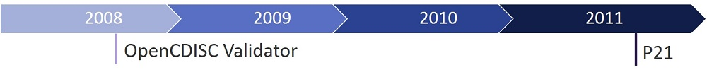
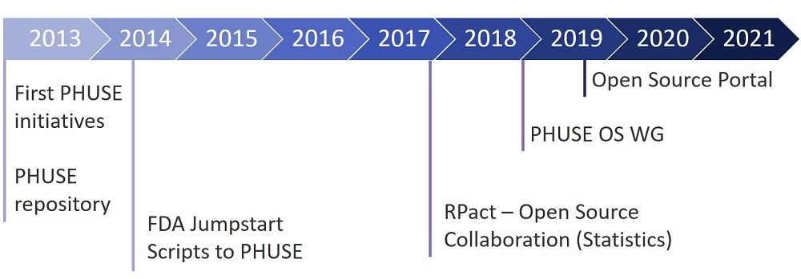
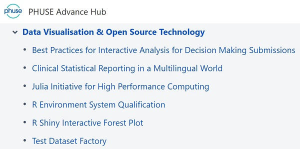
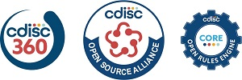
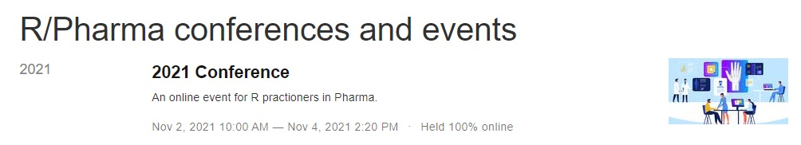
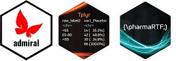

# Open Source News (2022-01-14)

## The History

A lot has happed recently in the area of open source for Pharma. Before we see what is currently going on, let's briefly dive into the recent years.

The core route of open source started with the OpenCDISC Validator which was a [project](https://www.pinnacle21.com/blog/the-history-of-opencdisc) run by two indivituals to support with the validation of CDISC standards as open source project. As these checks needs to be done by all pharma companies and there had not been something available, this tool was quickly taken up by most companies and resulted in a big success. To enable more functionality and support Pinnacle 21 was founded in 2011 to include an enterprise version, which allowed funding and for this growing.

In 2013 PHUSE created first inititives looking for more open source solutions in our area. The PHUSE repository was also created this time to support these efforts. A first break through was coming 2014 where the FDA delivered the "FDA Jumpstart Scripts" to PHUSE which is a set of SAS macros creating standard derivations the FDA is using for reviews. Unluckily this had not been taken up by the community. There had only been one paper from Novo Nordisk mentioning this package.

In 2017 [RPact](https://www.rpact.com/) was founded as a collaboration project from various pharma companies. These companies decided to fund an open source project which enabled the creation and development of the open source package RPact which also contains validation.

As open-source became more and more a hot topic, PHUSE decided to create a dedicted Open-Source working group when they restructured the working groups. This working group has now various subtopics dealing with different topics.

It was in 2019 where the Open Source Portal for clinical study evaluation has been released. This [portal](https://www.glacon.eu/portal) adresses the issue of finding available open source solutions in our area.

During these years we saw a lot of

* Knowledge exchange (conferences)
* Working group success
* Collaboration
* R Discussions

Changes need time, and this is specifically true for our industry. But the knowlege and awareness raised and with the recent years starting in 2020 we see more and more results of the various open source efforts!

## Organizations

### PHUSE

Various organizations are working to bring open-source forward. PHUSE is active since years and highly depends on volunteers running various inititives and working groups. The current Working group is named "Data Visualisation & Open Source Technology" containing various sub-projects. A lot of discussions about R and other programming languages are ongoing. The Test Dataset Factory is one of the already long running project where hopefully somewhen test data could be generated.

As PHUSE projects are all running purely on volunteers, they highly depend on motivated and active members. It's great what these PHUSE volunteers achieved! Of course some projects are not running fast or well documented due to priorities and motivation. It's the same like for open source projects.

### CDISC

CDISC classically is concentrating on data standards. But also CDISC has seen the potential of open source. In the CDISC 360° project CDISC is investigating end-to-end processes with many companies involved. Discussions around processes often also results in discussions about solutions and technology. So looking into implementations would be a next possible step.

CDISC founded just recently (2021) the CDISC Open Source Alliance ([COSA](https://cosa.cdisc.org/)) - which is available to 

> […] supports, promotes, and sometimes sponsors open-source software projects […]

Currently COSA has a repository which can be seen as information hub. The first webinar was about three COSA tools:

* TLFDesigner - an open source project just starting
* Visual DefineXML Editor - an available open source tool
* ODMLib - available scripts

A [recording](https://www.cdisc.org/events/webinar/cdisc-open-source-alliance-cosa-spotlight) is available. Next to further webinars, additionally hackathons, discussions and guidances are planned. The potential to support open-source in our industry is very high. 

One Project which implements processes and which is an open source project is CDISC CORE. The CDISC Open Rules Engine will support executable conformance rules which enables a better adherance to standards. This huge project has a lot of participants from the Pharma industry and from Microsoft. It will be added to COSA. We can expect a lot of lessions learned supporting also other open-source projects.

## Universe of R

The open source in Pharma topic is a lot related to R. R as an open source environment is under the discussion as alternative for SAS since years. But it's been just recently where more and more companies put efforts into R to perform complete submissions programmed in R.

The core visible driver of open source solutions in the area of R are Roche and GSK and the company Atorus which has been founded 2020 using R Open Source packages as their core business. 

### RConsortium

The [RConsortium](https://www.r-consortium.org/) is an organization to support the R community. They recently added a special pharma section. The following Pharma companies are members: BioGen, Roche, GSK, Janssen, Merck, Novo Nordisk. 

The RConsortium is running various working groups and maintain webinars about ["The R Adoption Series"](https://www.r-consortium.org/webinars). There had been a nice overview of "R Consortium Pharma Working Groups Overview and Updates" which is available as [recording](https://rinpharma.com/publication/rinpharma_211/) from the R in Pharma conference.

The active working groups are dealing with various topics around R. The [RValidation Hub](https://www.pharmar.org/) is a great group dealing with validation questions. They published a white paper, maintain a risk metrics package and provide quite some guidance and ideas on how to validate R packages.

The RTRS team (R Tables for Regulatory Submission) is working on develop standards for creating tables that meet the requirements of FDA submission documents. The idea is to colleact all requirements for submission tables, checkout what the different packages have available (RTables, huxtable, gt, ...) and create one package supporting all.

The "Submissions" team focus on IT and platform challenges that must be addressed in order to make "all R" regulatory submissions. This group was able to successfully submit an R-based test submission package to FDA eCTD gateway on 22. November 2021 ([blog](https://www.r-consortium.org/blog/2021/12/08/successful-r-based-test-package-submitted-to-fda)).

### R in Pharma

R/Pharma is also a working group under the R Consortium. The R/Pharma is a smaller conference concentrating on R for Pharma. In the presentations from various companies you can see how R is getting a bigger topic in our industy.

There is an R/Pharma "Shiny for Submissions" Task Force starting in January 2022 ([LinkedIn](https://www.linkedin.com/posts/philip-bowsher-67151015_rpharma-activity-6879137760716886016-C-2Z)). So apart from the conference itself additional working groups are forming.

The following presentations show quite well the progress in our industry:

* R Package Validation at Roche ([link](https://rinpharma.com/publication/rinpharma_192/))
* R Package Validation at Merck ([link](https://rinpharma.com/publication/rinpharma_193/))
* R Harmonization at Pfizer ([link](https://rinpharma.com/publication/rinpharma_202/))
* End to End Toolkit (GSK, Atorus) ([link](https://rinpharma.com/publication/rinpharma_215/))

### R Packages

R has a lot of packages. Some are very generic and can be used for various purposes and industry like the powerful GT package creating very generic tables. But sometimes these packages does not fulfill pharma specific requirements and for this some pharma specific packages are developered and also delivered as open source package. Those are for example the following:

* RTables (developered and maintained by Roche since 2017) to create outputs
* pharmaRTF (developed by Atorus, used by GSK) to create outputs
* tplyr (developed by Atorus, used by GSK) to derive summaries
* admiral (developed by Roche-GSK collaboration) to map SDTM to ADAM

More packages are in the planning phase to support the end-to-end processes in R. 

### R Notes

The [pharmaverse](https://pharmaverse.org/) is a new group to maintain a pharma stack of open source R packages to enable clinical reporting (from CRF to eSubmission). This should allow even better industry collaboration in the universe of R.

Novo Nordisk has submitted a trial where all tables, listings and figures are programmed with R ([LinkedIn](https://www.linkedin.com/posts/ari-siggaard-knoph-7b852575_rstats-rpharma-rforclinicalreporting-activity-6877394863894118400-GB8e)). Here we see that submitting in R is not only a test, but a real submission.

## Other Projects

But the industry is not only going forward in open-source in the area of R, but also in other areas.

Novo Nordisk announced that they will release an MDR tool to build studies. This linked data implementation in Neo4j is highly connected to the CDISC 360° project as well as the TransCelerate DDF project. A first release is expected in Q2-2022.

The TLFDesigner is a new starting project running under COSA to enhance the Analysis Results Metadata. This project is looking for participants and content details.

TransCelerate is investigating in open source as well as with DDF project. The full power of collaboration can be archieved through open source! I am sure there will be more projects to come, which are just not yet announced.

## Summary

As we can see, it took quite some time for open-source to gain traction. And now we can see it is taking big steps forward. The awareness is important. Content wise we mainly see new topics which are no longer handled company internal, but by collaboration. We see huge projects like CDISC supporting the community via COSA and running a huge project like CORE. We see first collaborations like for Roche-GSK with providing admiral. And there is much more to come.

To allow open source to grow and rule it is of crucial importance that we invest and participate in these projects. Then we can enter this new area of collaboration where we not only having standard data structures, but also standard tools throughout our industry.

## Disclaimer

The opinion in this article are purely those from the author and does not necessarily confirm those from mentioned organizations and companies, nor from the portal operator.

## About the Author

Katja Glaß has IT background and is for more than 15 years in the pharmaceutical industry. She is now working as part-time consultant focusing on open source for Pharma, hosting a portal about open-source solutions for clinical study evaluations. She has key experiences with SAS, Web Technologies, ADAM, Define.xml and the TLF generation. She is a very active PHUSE member where she led the EU Connect conference in 2018. In 2021 she became board member of COSA to support this initiative as well.
