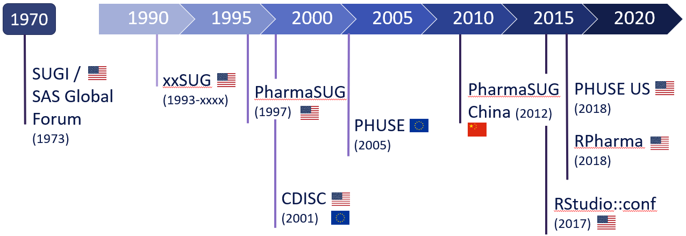
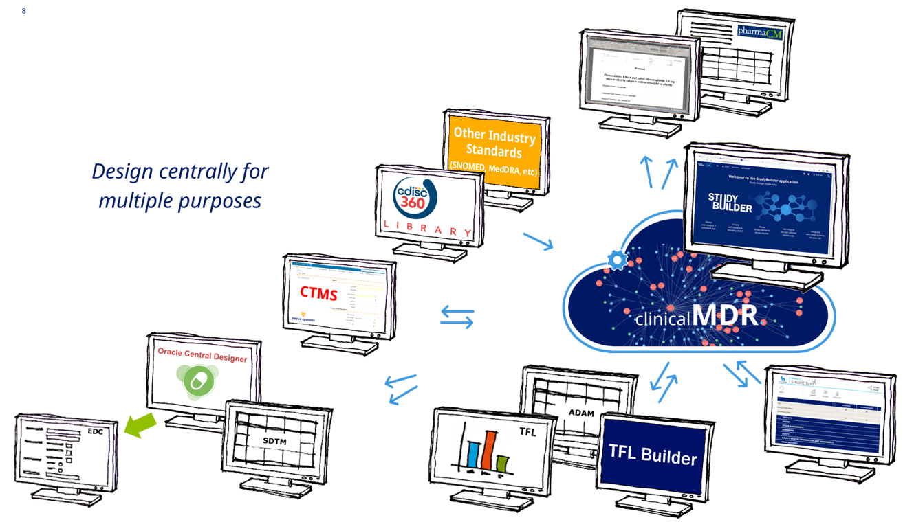
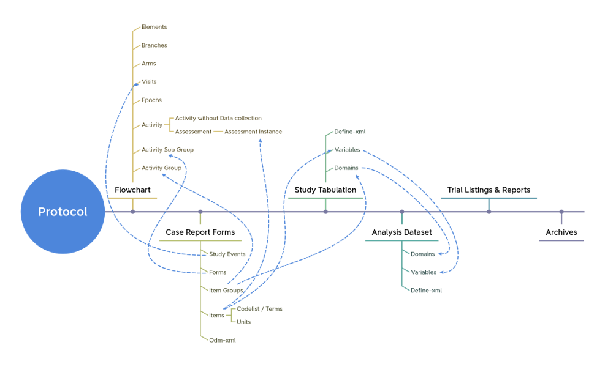
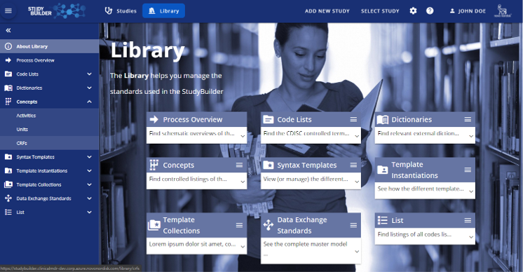

# Large Open-Source Projects as Game Changer (2022-07-20)

Large scale open source projects can become game changes in our industry as it can change the way how we work and collaborate. The pharmaverse initialitve as well as the OpenStudyBuilder are great examples where we will see the opportunities and visions.

## Introduction

In the pharmaceutical industry we see a high interest in more and more collaborations. It started with user groups and user driven conferences. The numbers of the conferences contineuously increase throughout the complete globe. Starting with the SAS user groups, going through the PHUSE conferences and nowadays also pharma focused R conferences has been setup.

We have a high need for our user conferences as we want to exchange our experiences, discuss challenges and solutions and provide tips and tricks. These conferences are much business driven and have a strong focus on the daily challenges and business.

Next to these conferences we see more and more working groups which are created to enable much better collaborations. Topics are discussed in details. Examples are created common guidelines like for "Good Programming Practices", "TLF Whitepapers", the "ADRG guide" and many more you can find on the PHUSE homepage. <TODO>link</TODO> Some groups dive deeply into specific topics like how to share code, e.g. via the PHUSE Code Repository, investigate how LinkedData and Biomedical Concepts work, what we can do with emerging trends, an education working group and there are also various R focused groups mainly driven by the R-Consortium.

The next level of collaboration is open-source where we not only can discuss about topics, but go down to implementations. We can share tools, processes and build a common understanding.

## Start-to-End Vision (CDISC 360° -> DDF & OpenStudyBuilde)

One collaboration project by CDISC was the [CDISC 360° project](https://www.cdisc.org/sites/default/files/2020-05/CDISC_360_Project_Description.pdf). This project has a "Start-to-End" vision to have biomedical concepts (linked data based) available to allow full traceability and many automations. But the vision is not enough. To really go forward we need implementaions. 

Based on the CDISC 360° ideas and the vision, TransCelerate created the "Digital Data Flow" (DDF) project. The idea of DDF is to have a "Study Definitions Repository" and standard interfaces so called APIs. The open source reference implementation should demonstrate what is possible how easy integrations of various tools can be done by using next to standard data also standard interfaces. CDISC is working on a biomedical model to allow semantics and linked data logic on our standards.

The OpenStudyBuilder which is a project by NovoNordisk and is going to become open-source this year, has the same goal and is aiming to become a DDF compliant reference implementation. The heart of the OpenStudyBuilder is a metadata repository storing next to study definitions other information in a biomedical model.

## OpenStudyBuilder

The idea of the OpenStudyBuilder is to have all information stored as a graph database with a biomedical concept behind which is the clinical MDR and build the heart. Various tools connect to this via standard APIs. Where there is an overlap with the TransCelerate DDF project, the same DDF APIs can be used for the OpenStudyBuilder which enables easy integrations with any other tools. 

The biomedical concepts allows for traceabiliy and connection of various tools. For this CRF tools can gather main information to create the final eCRFs and provide these information back. Collected items are going into the different data models like SDTM and ADAM and major mapping rules could also be derived from the concept.

**Why now?** NovoNordisk created the OpenStudyBuilder to replace their internal legacy system. They had been highly involved into the CDISC 360° project and figured out that this is what they need. As such projects takes typically quite some time, NovoNordisk decided to create an in house project to implement the ideas in a timely manner. They could not wait more years until the first solutions get out. The development already started in 2020 and this year it's rolled out internally. The TransCelerate DDF project has a high scope overlap, but their first reference implementation has just been released this year. The first final solutions still needs additional time. 

NovoNordisk needed a solution quickly, but they still want to use modern approaches like the concept base standards. For this they decided on practicalities like implementing what they need right away and create the compliance afterwards. For this a DDF adapter is on the way to enable all tools supporting DDF, also supporting the OpenStudyBuilder. The internally used Biomedical Concept also does not implement what CDISC is going to release as Biomedical Concept, as this is currently still ongoing by CDISC. But practical solutions has to be done to have the opportunity to replace the legal system now and not in the far future. One main focus point was to have a sustainable model for maintenance and integrations. 

**Why OpenSource?** The decision to go open-source with this tool has been done to enable collaborations. The goal is to follow industry standards as provided by CDISC and TransCelerate with the DDF-API specifications. NovoNordisk is not interested in a custom tool. They would love a solution which is flexible, generic and can be enhanced by many others as well. Having the framework as open-source with the heart and the standard APIs, collaborations and extensions are easily possible. As it's designed as open-source, the implementation is very modular and it's expecting that the same task could be done by different tools. NovoNordisk also likes the opportunity to be an active player in the industry transformation to be more open.

**Status?** The OpenStudyBuilder contains currently the MDR as heart component where CDISC and sponsor specfic standards can be uploaded, maintained and processed. It currently contains protocol information as well as Trial Domain information and the first SDTM definitions. There is already a running evaluation environment available which had been used by workshop participants from various companies. The open-source-release is planned for Q3/Q4 with various rollout options to support different community members from single persons and small CROs to huge pharma companies.

## Open Source as Game Changer

So why can open source be a game changer in our industry?

Open source allows for very flexible and easy integrations. This is currently a main pain point for any kind of software exchange in our industry. The tools are typically highly depending on each other but the integations had to be done individually which is for propriaty software often extremly difficult. Open source is designed to work with different tools and is open to change. What ever is required could easily be implemented.

For the OpenStudyBuilder it would easily be possible to create a SAS macro to download codelists or the Trial Summary informatoin. To review and edit metadata and/or codelists a graphical user interface, e.g. a website could be used. If people insist on Excel (please don't), then integration with Excel is also possible due to the open API design. These standard interfaces really allows for what ever solutions are best fitting. And when these solutions are made available as open source as well we can get to an environment where we can plug and play like used from the app-store. 

## Disclaimer

The views and opinions expressed in this presentation are those of the author and do not necessarily reflect those of any mentioned organization or company.

## About the Author

Katja Glaß has IT background and is for more than 15 years in the pharmaceutical industry. She is now working as part-time consultant focusing on open source for Pharma, hosting a portal about open-source solutions for clinical study evaluations. She has key experiences with SAS, Web Technologies, ADAM, Define.xml and the TLF generation. She is a very active PHUSE member where she led the EU Connect conference in 2018. In 2021 she became board member of COSA to support this initiative as well.