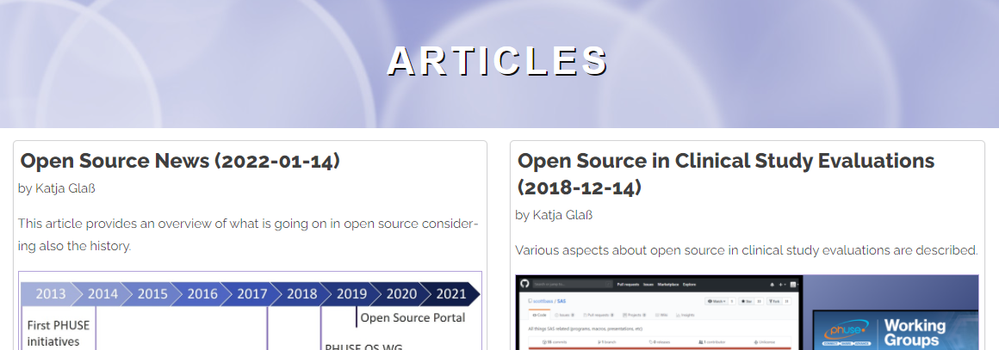

# Instructions to add an article (/article)

You can easily also request to add an article to the open source portal by creating the content as a separate markdown file. Currently two examples are already in which are also included in the portal as well.

If you are not familar with forks and pull requests, please checkout the [Tips for Fork, Save, Edit and Pull](./tips_fork.md).

## License Notice

Be aware that this repository is using the [CC-BY-4.0](https://creativecommons.org/licenses/by/4.0/) license for content. This means that the content of your article can be re-used and mentioned openly by reference.

## Header Section

The header section for the markdown files contains meta information which are partially used already or will be used later on, e.g. for tagging. Please fill out all attributes accordingly. As license either use CC-BY4.0 or CC0.

The following extract shows an example header:

```
---
title: Open Source News
date: "2022-01-14"
author: Katja Glaß
company: Katja Glass Consulting
companyType: independent
tags: [General]
license: CC-BY-4.0 (https://creativecommons.org/licenses/by/4.0/)
img: 2022-01-14OSNews01.jpg
summary: This article provides an overview of what is going on in open source considering also the history.
---
```

Key | Description
--- | ---
title | The title of the abstract, used in the overview
date | The likely publication date - please plan ~1 week for review/release
author | Name of the author(s)
company | Name of the company(s)
tags | Array list of tags, e.g. `General`, `Tool`, `R`, `SAS`, `CDISC`. Multiple tags can be used as list, e.g. [Tool, R] - These might be updated/modified later on depending on the needs for the visualization
license | License to be applied, either use CC-BY-4.0 or CC0
img | Image to be used as summary-display image. Should be located in article/img.
Summary | Summary text describing in short what this article is about. This will be used in the overall summary where articles can be selected.

The article summary is currently derived from the header and looking like this:



The following fieds are used:

- title
- date
- author
- summary
- img

## Article Content

The article content should be written in Markdown. Please name the article using the estimated release date as prefix and a speaking name. Article related images should be stored in article/img and using the same name as the article itself as prefix. All images must be smaller than 500 kb.

All markdown formattings can be used. See [here](https://www.markdownguide.org/cheat-sheet/) for a Cheat Sheet. Additional HTML tags are supported, e.g. like `<div>` for specific formatting, but this is typically not required and not recommended. Review time when using various HTML-tags is longer.

### Images

Theoretically images can be embedded easily via this:

``

As the portal homepage might be opened on a mobile device, please do not use this simple image linking, but the following:

`" maxwidth="100%" alt="<DESCRIPTION>">`

Then large images will be sized to fit nicely on the page and does not "run over" of the screen.

### Commercial Content

The scope of the open source portal is to support the open source development and usage within the industry. Only open and free articles are supported. For this commercial content is not to be included. The maintainer of the portal likely will reject any pull-requests focusing on commercial content.

Of course links to companies, solutions, offerings are possible, but these must be in scope of openess and the article must have no commercial focus. 

## Release notes for Open Source Portal

After you created a pull request, this is checked by the maintainer of the open source portal. It might be that minor modifications are done (e.g. modify tags) before the request is accepted. 

If there are questions/requests, the discussion functionality for the pull request might be used.