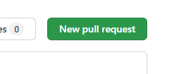

# Tips to Fork, Edit, Save and Pull

As there is no default write access to this repository, you need to follow the typical workflow. Create a copy in your own area, update this as you wish and then request this to be added to the official repository. This is done via Fork and a Pull-Request.

## Fork

First, you need to "fork" the repository which creates a copy in your personal area, where you can create updates.

When you open the GitHub repository there are buttons on the top right:

## Edit (in VSCode in Browser)

One option to easily edit files is using the browser version of VSCode (a development environment). To get there press the "." key on your keyboard, when you are in your repository. You can also exchange the URL manually.

The URL will change from `.com` to `.dev`:

Example:

- https://github.com/Cayburn/clinicalOpenSourcePortal Repository
- https://github.dev/Cayburn/clinicalOpenSourcePortal Opened in VSCode

You can work there as usual, e.g. use STRG+C and STRG+P to make a copy of an article. You can drag and drop additional images. Edit text in the editor. There is also a live preview to see immediately when you type the article.

Click the "Preview" button to enable the preview:

On the leften side you have the Explorer where you can copy, paste, drag and drop files and more. In the middle you have the editing area and on the left you see the direct visualization.

### Preview Error

When the following error is received when the markdown file should be previewed, the issue is likely  as a "Block third-party cookies" is set. Enable these coockies and then it should run. You can also specificlly add [*.]github.dev to "Sites that can always use cookies".

> Error loading webview: [...] The user denied permission to use Service Worker.

## Save

Currently all your changes are made, but not "commited" to your repository. To "save" your changes, you need to go to the "Source Control" panel. This is located on the leften side:

To commit your changes to your personal repository you need to include a desciption (1) and then commit (2) your changes.

Back to your repository (github.com), you should be able to see all your changes. 

## Pull request to Open Source Portal

To finally submit your changes to the clinicalOpenSourcePortal repository, you must submit a "pull-request". 

Go to the "Pull request" tab:

Click the "New pull request" button

In the next window you can review the changes and details what should be put to where. In the top line you can see that from the "Cayburn/ClinicalOpenSourcePortal" to the "KatjaGlassConsulting/clinicalOpenSourcePortal" should be pulled.

Finally just click the "Create pull request" and the request is done.

As a final step, the maintainer of the original repository needs to accept the pull request, which might take some time.